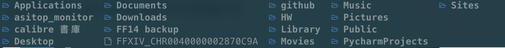

# dotfile settings

this menghao develop environment setting config

# Neovim

- 參考網址: [Set up Neovim on a new M2 MacBook Air for coding React, TypeScript, Tailwind CSS, etc.](https://www.youtube.com/watch?v=ajmK0ZNcM4Q&list=PLxQA0uNgQDCICMRwlOzWAZBPL05XBC_br&index=16v)

# tmux

- 參考網址: [How To Use and Configure Tmux Alongside Neovim](https://www.josean.com/posts/tmux-setup)
- 參考影片: [Youtube](https://www.youtube.com/watch?v=U-omALWIBos)
- 安裝 plugins: "(Ctrl + b)" + "(shift + i)"
- 解除 plugins: "(Ctrl + b)" + "alt (iTerm2 -> Profiles -> Keys -> ESC+)" + "u"

# Homebrew

- 輸入下面這段指令來復原 homebrew 和 App Store 的軟體（記得要先安裝 homebrew）

        brew bundle

## exa – a modern replacement to ls command

- ll :
  

- ls :
  

- lt :
  

## tmux 操作

- "(Ctrl + b)" + "r" : refresh tmux config in tmux mode
- "(Ctrl + b)" + "n: next, p: previous, 0~9" : switch between windows in session
- "(Ctrl + b)" + "," : rename windows

## Neovim 操作

- y : copy
- p: paste
- ^n : 向下選擇字詞
- ^p : 向上選擇字詞

- "/" + {word} : 收尋字詞 （in visual model）

- :NvimTreeToggle

  - “space_bar” + “e” : expand explorer
  - “a” : add new file under path
  - "r" : rename file name
  - "d" : delete file

- nvim-telescope
  - ; + r : live_grep, search word in this file
  - ; + f : find file
  - s + f : file browser
    - “/” : search file mode
    - “a” : create new file - "r" : rename file name
    - "d" : delete file
  - q : quit telescope mode

– nvim-tabs-bufferline

- t + e : open new tab and edit
- shift + tab : go to left tab
- tab : go to right tab

- LSP config
  - gf : lsp_finder search
  - gd : preview_definition
  - gD : jump into declaration
  - Ctrl + o : go back from declaration to your file
  - q : close interface

### 安裝 Neovim

- 記得要先安裝 Homebrew

        brew install neovim

### Step 1

1. 在.config 資料夾下創建 **nvim** 資料夾
2. 在 nvim 資料夾下創建以下的資料夾結構
   

### Step 2 (**base lua**)

- 進入 nvim 介面，在底下輸入 :
  - :set fileencoding=utf-8
  - :set encoding=utf-8
  - :set backupskip
  - :set wildignore

### Step 3 (**install packer**)

- Install [Packer](https://github.com/wbthomason/packer.nvim) by running the below command (under **.config/nvim/** ) :

        git clone --depth 1 https://github.com/wbthomason/packer.nvim \
        ~/.local/share/nvim/site/pack/packer/start/packer.nvim

- 進入 nvim 介面，在底下輸入 :
  - :PackerInstall

### Step 4 (**Status line: Lualine**)

- 進入 nvim 介面，在底下輸入 :
  - :PackerInstall

### Step 5 (**LSP config**)

- install lua language server

        brew install lua-language-server

  - control-N (^N) 可向下選擇字詞
  - control-P (^P) 可向上選擇字詞
    

- install typescript language server

  - go into nvim, type command line:

        :Mason

  - check the language servers were installed

### Step 6 (**Auto-completion: Lspkind and cmp**)

- To get LSP-aware auto-completion feature with fancy pictograms ,I use the following plugins:

  - [onsails/lspkind-nvim](https://github.com/onsails/lspkind.nvim) - VSCode-like pictograms
  - [L3MON4D3/LuaSnip](https://github.com/L3MON4D3/LuaSniphttps://github.com/L3MON4D3/LuaSnip) - Snippet engine
  - [hrsh7th/cmp-nvim-lsp](https://github.com/hrsh7th/cmp-nvim-lsp) - nvim-cmp source for neovim's built-in LSP
  - [hrsh7th/cmp-buffer](https://github.com/hrsh7th/cmp-buffer) - nvim-cmp source for buffer words
  - [hrsh7th/nvim-cmp](https://github.com/hrsh7th/nvim-cmp) - A completion engine plugin for neovim

- 進入 nvim 介面，在底下輸入 :
  - :PackerInstall

### Step 7 (**Syntax highlightings: Treesitter**)

- First install tree-sitter:

        brew install tree-sitter

- 再來進入以下 Path 進行編輯:

        .config/nvim/lua/plugins.lua

- 暫時修改 packer plugin 的描述：

  ```
  use {
      'nvim-treesitter/nvim-treesitter',
      run = function() require('nvim-treesitter.install').update({ with_sync = true }) end,
  }
  ```

- 在以上程式碼區塊中，加入以下程式碼：

        run = ':TSUpdate'

- 在 Visual 介面執行 “:TSUpdate”
- 確認執行沒問題後即可刪除加入的描述

### Step 8 (**Autotag and Autopair**)

- For React apps, you often want to close tags quickly.
- ts-autotag
- autopairs is for closing brackets.
- 進入 nvim 介面，在底下輸入 :
  - :PackerInstall

### Step 9 (**Code formatter: mason-null-ls and null-ls**)

- 進入 nvim 介面，輸入以下指令以查看是否安裝 formatters & linters

        :Mason

- 在 Mason 介面下的操作：

  - i : install
  - shift + x : uninstall
